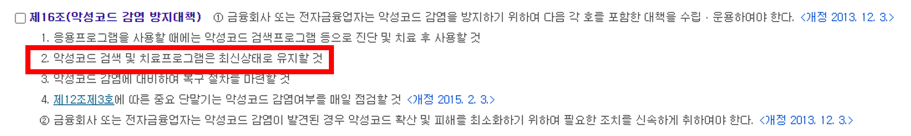
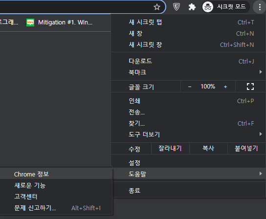
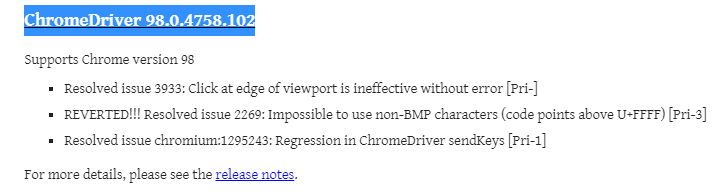
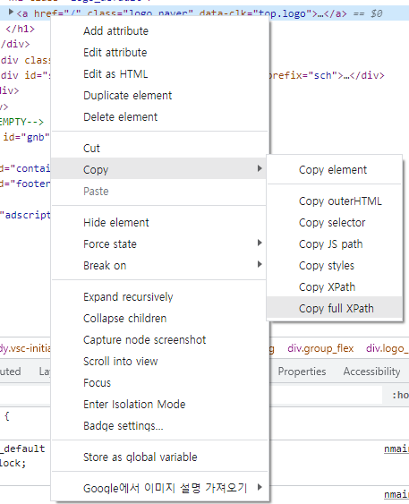

# 개론

「전자금융감독규정」제 16조에 따라 백신 엔진 패턴을 항상 최신화 해야합니다.


보통의 PC는 인터넷이 연결되어있기 때문에 백신 엔진 패턴이 자동으로 업데이트 되지만, 금융권은 망분리 규정으로인해 인터넷이 불가하기때문에 백신 공식 홈페이지에서 패턴 파일을 직접 다운받아 내부망으로 이동시킨 후 수동으로 업데이트를 해야합니다.

매일 하기엔 공수가 많이들어 자동으로 파일을 다운로드 받고, 업로드할 수 있는 자동화 스크립트를 작성해보겠습니다.

# 업무설명

1. 안랩 공식홈페이지에 로그인한다.
2. 패턴 파일을 다운로드 한다.
3. 다운로드 받은 파일이 이상없는지 무결성 검사를 한다.(hash값 비교)
   
4. USB로 옮긴다.
   

# 구현 전략

크롬을 자동으로 띄우고, 로그인 후 다운로드를 받는 기능을 구현해야합니다.
위의 기능을 구현하기 위해서는 크롬을 동적으로 다룰 수 있는 **셀레니움**과 **Chrome driver**를 사용합니다.

## 셀레니움 ?

셀레니움은 웹 애플리케이션 테스트를 위한 프레임워크입니다. 웹 UI, 기능 테스트 뿐 아니라 크롤링에도 많이 사용됩니다.

## 크롬 드라이버 ?

크롬 드라이버는 크롬브라우저를 컨트롤 할 수 있게 해주는 파일입니다. 셀레니움으로 크롬 드라이버 기능을 사용하여 크롬 브라우저를 조작할 예정입니다.

# 구현

우선 크롬 드라이버를 다운받습니다. 설치된 크롬 버전에 맞는 드라이버를 다운받아야합니다.

### 크롬 버전 확인하기

※ 해당 코드는 아래 포스트를 참고하여 작성하였습니다.
[Python] (크롤링으로 업무 자동화)[https://dc7303.github.io/python/essay/2019/12/01/pythonMakedCrawler1/]

1. 우측상단 더보기 아이콘 클릭 후 설정
   
2. 크롬 버전정보
   

버전은 98.0.4758.102이므로, 해당버전을 다운받습니다.

https://chromedriver.chromium.org/downloads

### 셀레니움 사용하기

```cmd
pip install selenum
```

**chromedirver.py** 파일을 생성하고, 셀레니움 webdriver를 import 합니다.

```python
from selenium import webdriver
```

### 크롬 조작 인스턴스 정의

```python
from selenium import webdriver

def generate_chrome(
    driver_path: str,
    download_path: str,
    headless: bool=False
    ) -> webdriver:
    """
    크롭 웹드라이버 인스턴스 생성

    :param driver_path: 드라이버 경로
    :param download_path: 파일 다운로드 경로
    :param headless: headless 옵션 설정 플래그

    :return webdriver: 크롬 드라이버 인스턴스
    """
```

### 크롬 브라우저 옵션 세팅

```python
from selenium import webdriver

def generate_chrome(
    driver_path: str,
    download_path: str,
    headless: bool=False
    ) -> webdriver:
    """
    크롭 웹드라이버 인스턴스 생성

    :param driver_path: 드라이버 경로
    :param download_path: 파일 다운로드 경로
    :param headless: headless 옵션 설정 플래그
    :return webdriver: 크롬 드라이버 인스턴스
    """

    options = webdriver.ChromeOptions()
    if headless:
        options.add_argument('headless')
        options.add_argument('--disable-gpu')
    options.add_experimental_option('prefs', {
        'download.default_directory': download_path,
        "profile.default_content_settings.popups": 0,
        "safebrowsing.enabled": True
    })

    chrome = webdriver.Chrome(executable_path=driver_path, options=options)

    if headless:
        _enable_download_in_headless_chrome(chrome, download_path)

    atexit.register(_close_chrome(chrome))       # 스크립트 종료전 무조건 크롬 종료

    return chrome
```

**headless** : 브라우저 창을 띄우지않고 프로세스를 실행합니다.

**--disable-gpu** : 브라우저가 CPU의 부담을 줄이고자 렌더링 시 GPU를 사용하여 그래픽 가속을 하는데, GPU 버그가 일어날 수 있기때문에 GPU 사용을 disable 시킵니다.

**download.default_directory: download_path** : 다운로드 경로를 download_path로 설정합니다.  
**profile.default_content_settings.popups: 0** : 팝업을 금지합니다.  
**safebrowsing.enabled: True** : 세이프 브라우징모드를 킵니다. 이 값이 없다면, exe파일 다운로드받을 때 경고창이 울려 자동으로 다운로드받지 못합니다.

```python
def _enable_download_in_headless_chrome(driver: webdriver, download_dir: str):
        """
        headless does not allow file download: https://bugs.chromium.org/p/chromium/issues/detail?id=696481
        크롬 드라이버는 크롤링을 이용한 해킹을 예방하기 위해 기본적으로 headless 모드에서 다운로드를 지원하지 않는다.
        전문을 먼저 보내야 사용이 가능. 자세한 내용 위 링크 참조
        :param driver: 크롬 드라이버 인스턴스
        :param download_dir: 파일 다운로드 경로
        """
        driver.command_executor._commands["send_command"] = ("POST", '/session/$sessionId/chromium/send_command')

        params = {
            'cmd': 'Page.setDownloadBehavior',
            'params': {
                'behavior': 'allow',
                'downloadPath': download_dir
            }
        }
        driver.execute("send_command", params)
```

### 크롬 종료 함수

모든 프로세스가 끝나면 크롬을 종료합니다. atexit를 통해 프로세스 종료 직전에 실행됩니다.

```python
def _close_chrome(chrome: webdriver):
    """
    크롬 종료
    :param chrome: 크롬 드라이버 인스턴스
    """
    def close():
        chrome.close()
    return close
```

### 최종적인 chromedriver 코드

```python
import atexit
from selenium import webdriver

def _enable_download_in_headless_chrome(driver: webdriver, download_dir: str):
        """
        headless does not allow file download: https://bugs.chromium.org/p/chromium/issues/detail?id=696481
        크롬 드라이버는 크롤링을 이용한 해킹을 예방하기 위해 기본적으로 headless 모드에서 다운로드를 지원하지 않는다.
        전문을 먼저 보내야 사용이 가능. 자세한 내용 위 링크 참조
        :param driver: 크롬 드라이버 인스턴스
        :param download_dir: 파일 다운로드 경로
        """
        driver.command_executor._commands["send_command"] = ("POST", '/session/$sessionId/chromium/send_command')

        params = {
            'cmd': 'Page.setDownloadBehavior',
            'params': {
                'behavior': 'allow',
                'downloadPath': download_dir
            }
        }
        driver.execute("send_command", params)


def _close_chrome(chrome: webdriver):
    """
    크롬 종료
    :param chrome: 크롬 드라이버 인스턴스
    """
    def close():
        chrome.close()
    return close


def generate_chrome(
    driver_path: str,
    download_path: str,
    headless: bool=False
    ) -> webdriver:
    """
    크롭 웹드라이버 인스턴스 생성

    :param driver_path: 드라이버 경로
    :param download_path: 파일 다운로드 경로
    :param headless: headless 옵션 설정 플래그
    :return webdriver: 크롬 드라이버 인스턴스
    """

    options = webdriver.ChromeOptions()
    if headless:
        options.add_argument('headless')
        options.add_argument('--disable-gpu')
    options.add_experimental_option('prefs', {
        'download.default_directory': download_path,
        'download.prompt_for_download': False,
        "profile.default_content_settings.popups": 0,
        "safebrowsing.enabled": True
    })

    chrome = webdriver.Chrome(executable_path=driver_path, options=options)

    if headless:
        _enable_download_in_headless_chrome(chrome, download_path)

    atexit.register(_close_chrome(chrome))       # 스크립트 종료전 무조건 크롬 종료

    return chrome
```

### 인스턴스 생성

크롬 브라우저 기동 기능은 완료했습니다. 이제 자동화 기능을 구현만 남았습니다.

프로젝트/다운로드 경로, 운영체제 판별을 위한 모듈을 import하고, 프로젝트, 다운로드, 드라이버 경로를 설정합니다.

그 후 운영체제를 판별하고, 해당 운영체제에 맞는 드라이버를 사용할 수 있도록 설정해줍니다.

그 후 크롬 인스턴스를 생성합니다.

```python
#!/usr/bin/python
# main.py

import sys
import os
import time
import subprocess
import shutil

from chromedriver import generate_chrome
from selenium.webdriver.common.keys import Keys
from selenium.webdriver.chrome.options import Options

# 프로젝트, 다운로드 경로 설정
PROJECT_DIR = str(os.path.dirname(os.path.abspath(__file__)))
DOWNLOAD_DIR = f'{PROJECT_DIR}\download'
driver_path = f'{PROJECT_DIR}/lib/webDriver/'

# 운영체제 판별
platform = sys.platform
if platform == 'darwin':
    print('System platform : Darwin')
    driver_path += 'chromedriverMac'
elif platform == 'linux':
    print('System platform : Linux')
    driver_path += 'chromedriverLinux'
elif platform == 'win32':
    print('System platform : Window')
    driver_path += 'chromedriverWindow'
else:
    print(f'[{sys.platform}] not supported. Check your system platform.')
    raise Exception()

# 크롬 드라이버 인스턴스 생성
chrome = generate_chrome(
    driver_path=driver_path,
    headless=False,
    download_path=DOWNLOAD_DIR)
```

다음은 업무 수행 절차를 코드로 구현하면 됩니다.

구현하려면 셀레니움의 **메소드 동작방식**과 **XPath**에 대해서 알아야합니다.

위 작업을 자동화 하려면 특정 엘리먼트들(버튼, input 등)을 **①선택**하고 **②입력**하고 **③클릭**하는 기능을 python으로 구현해야합니다.

셀레니움으로 엘리먼트를 선택하는 문법은 아래와 같습니다.

```python
chrome.find_element_by_xpath('XPath')
```

XPath는 XML문장 속의 요소, 속성 등을 지정하기 위한 언어입니다.
선택할 엘리먼트 태그를 우클릭하면 해당 엘리먼트의 XPath를 얻을 수 있습니다.



```python
# login ~ enter download page
url = 'https://mycompany.ahnlab.com/'
chrome.get(url)
time.sleep(1.5)
```

github 주소 (https://github.com/wind-flow/avdownload)
