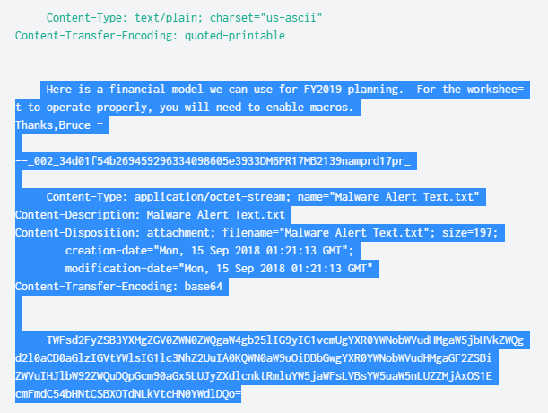
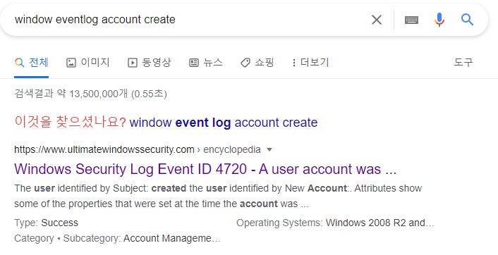



- secnario #1  
Note: All the information you need to answer each question is present within the question itself. You just need to figure out how to create the proper splunk search query that will get you the information you want.  
각 질문에 답하는 데 필요한 모든 정보는 질문 자체에 있습니다. 원하는 정보를 얻을 수 있는 적절한 splunk 검색 쿼리를 생성하는 방법을 알아내기만 하면 됩니다.

BOTS-V3

index=botsv3의 sourcetype은 아래와 같습니다.

```
| metadata type=sourcetypes index=botsv3
| stats values(sourcetype)
```
- sourcetype 목록  

|values(sourcetype)|
|---|
|PerfmonMk:Process|
|Script:GetEndpointInfo|
|Script:InstalledApps|
|Script:ListeningPorts|
|Unix:ListeningPorts|
|Unix:SSHDConfig|
|Unix:Service|
|Unix:Update|
|Unix:Uptime|
|Unix:UserAccounts|
|Unix:Version|
|WinHostMon|
|access_combined|
|alternatives|
|amazon-ssm-agent|
|amazon-ssm-agent-too_small|
|apache_error|
|aws:cloudtrail|
|aws:cloudwatch|
|aws:cloudwatch:guardduty|
|aws:cloudwatchlogs|
|aws:cloudwatchlogs:vpcflow|
|aws:config:rule|
|aws:description|
|aws:elb:accesslogs|
|aws:rds:audit|
|aws:rds:error|
|aws:s3:accesslogs|
|bandwidth|
|bash_history|
|bootstrap|
|cisco:asa|
|cloud-init|
|cloud-init-output|
|code42:api|
|code42:computer|
|code42:org|
|code42:security|
|code42:user|
|config_file|
|cpu|
|cron-too_small|
|df|
|dmesg|
|dpkg|
|error-too_small|
|errors|
|errors-too_small|
|ess_content_importer|
|hardware|
|history-2|
|interfaces|
|iostat|
|lastlog|
|linux_audit|
|linux_secure|
|localhost-5|
|lsof|
|maillog-too_small|
|ms:aad:audit|
|ms:aad:signin|
|ms:o365:management|
|ms:o365:reporting:messagetrace|
|netstat|
|o365:management:activity|
|openPorts|
|osquery:info|
|osquery:results|
|osquery:warning|
|out-3|
|package|
|protocol|
|ps|
|stream:arp|
|stream:dhcp|
|stream:dns|
|stream:http|
|stream:icmp|
|stream:igmp|
|stream:ip|
|stream:mysql|
|stream:smb|
|stream:smtp|
|stream:tcp|
|stream:udp|
|symantec:ep:agent:file|
|symantec:ep:agt_system:file|
|symantec:ep:behavior:file|
|symantec:ep:packet:file|
|symantec:ep:risk:file|
|symantec:ep:scm_system:file|
|symantec:ep:security:file|
|symantec:ep:traffic:file|
|syslog|
|time|
|top|
|usersWithLoginPrivs|
|vmstat|
|who|
|wineventlog|
|xmlwineventlog|
|yum-too_small|

300	What is the full user agent string that uploaded the malicious link file to OneDrive?  
OneDrive에 악성 링크 파일을 업로드한 전체 사용자 에이전트 문자열은 무엇입니까?
<details>
  <summary>hint#1</summary>
    Use ms:o365:management as the sourcetype for OneDrive activity.<br>
    OneDrive 활동의 원본 유형으로 ms:o365:management를 사용합니다.
</details>
<details>
  <summary>hint#2</summary>
    A link (or .lnk) file is a shortcut file. Look for link files that are associated with OneDrive.<br>
    링크(또는 .lnk) 파일은 바로 가기 파일입니다. OneDrive와 연결된 링크 파일을 찾습니다.
</details>
<details>
  <summary>hint#3</summary>
    Filter your search to just upload activity.<br>
    활동을 업로드하기 위해 검색을 필터링하십시오.
</details>

OneDrive를 검색하니 sourcetype이 ms:o365:management, o365:management:activity 두가지가 나옵니다.
두가지 sourcetype의 필드를 조사해보니 Operation의 필드에 FileUploaded라는 값이 있습니다.
이 sourcetype에 UserAgent 필드가 있으므로 해당 값이 답일것입니다.

```
OneDrive .lnk Operation=FileUploaded
| table UserAgent
```

답 : Mozilla/5.0 (X11; U; Linux i686; ko-KP; rv: 19.1br) Gecko/20130508 Fedora/1.9.1-2.5.rs3.0 NaenaraBrowser/3.5b4

301	What external client IP address is able to initiate successful logins to Frothly using an expired user account?  
만료된 사용자 계정을 사용하여 Frothly에 성공적으로 로그인할 수 있는 외부 클라이언트 IP 주소는 무엇입니까?
<details>
  <summary>hint#1</summary>
    Use ms:aad:signin as the sourcetype for Azure Active Directory sign-in activity.<br>
    Azure Active Directory 로그인 활동의 소스 유형으로 ms:aad:signin을 사용합니다.
</details>

로그인관련 이벤트는 AD에있을것입니다. sourcetype에 **ms:aad:signin**란 sourcetype이 있습니다.
expired 키워드로 조사해봅니다.

```
sourcetype=ms:aad:signin expired
```

ID는 Kevin Lagerfield, ip는 199.66.91.253, expired된 비밀번호로 로그인을 시도했습니다.
해당 정보로 다시 검색해봅니다.

```
sourcetype=ms:aad:signin "Kevin Lagerfield" 199.66.91.253
```

해당 계정으로 로그인을 성공한 이벤트를 발견할 수 있습니다.

답 : 199.66.91.253

302	According to Symantec's website, what is the discovery date of the malware identified in the macro-enabled file? Answer guidance: Provide the US date format MM/DD/YY. (Example: January 1, 2019 should be provided as 01/01/19)  
시만텍 웹사이트에 따르면 매크로 실행 파일에서 식별된 악성코드의 발견 날짜는 언제입니까? 답변 안내: 미국 날짜 형식 MM/DD/YY를 제공하십시오. (예시: 2019년 1월 1일은 01/01/19로 제공되어야 함)
<details>
  <summary>hint#1</summary>
    Use ms:aad:signin as the sourcetype for Azure Active Directory sign-in activity.
    Azure Active Directory 로그인 활동의 소스 유형으로 ms:aad:signin을 사용합니다.
</details>
<details>
  <summary>hint#2</summary>
    Use WinEventLog:Application as the sourcetype to identify the security risk found.<br>
    WinEventLog:Application을 소스 유형으로 사용하여 발견된 보안 위험을 식별합니다.        
</details>
<details>
  <summary>hint#3</summary>
    Google search for that risk and the term Symantec together.<br>
    Google에서 해당 위험과 Symantec이라는 용어를 함께 검색합니다.
</details>

조사 방향을 잡기힘드니 **macro**로 검색해봅니다.
```
*macro*
```

그럼 19개의 이벤트가 발생하는데, stream:smtp로그가 눈에 띕니다.

첨부파일 **Malware Alert Text.txt**의 base64 인코딩값을 발견할 수 있습니다. 디코딩해봅시다.

```
Malware was detected in one or more attachments included with this email message. 
Action: All attachments have been removed.
Frothly-Brewery-Financial-Planning-FY2019-Draft.xlsm	 W97M.Empstage
```

추후 마저 풀겠음 

303	What is the password for the user that was successfully created by the user "root" on the on-premises Linux system?  
온프레미스 Linux 시스템에서 사용자 "루트"가 성공적으로 생성한 사용자의 비밀번호는 무엇입니까?
<details>
  <summary>hint#1</summary>
    Use osquery:results as the sourcetype.<br>
    sourcetype osquery:results에서 조사하세요.
</details>
<details>
  <summary>hint#2</summary>
    Osquery is logging command executions on the Linux host hoth.<br>
    Osquery는 Linux 호스트 hoth에서 명령 실행을 기록하고 있습니다.
</details>

linux에서 사용자 추가명령어는 useradd 혹은 adduser입니다.

```
sourcetype=osquery:results *useradd* OR *adduser*
```
이벤트2개가 뜹니다.

cmdline: "useradd" "-ou" "tomcat7" "-p" "ilovedavidverve" "0" "-g" "0" "-M" "-N" "-r" "-s" "/bin/bash"
cmdline: "useradd" "-ou" "tomcat7" "-p" "davidverve.com" "0" "-g" "0" "-M" "-N" "-r" "-s" "/bin/bash"

이중, 실행한 uid가 0인 이벤트의 비밀번호값은 ilovedavidverve입니다.

답 : ilovedavidverve

304	What is the name of the user that was created after the endpoint was compromised?  
엔드포인트가 손상된 후 생성된 사용자의 이름은 무엇입니까?
<details>
  <summary>hint#1</summary>
    Use WinEventLog:Security as the sourcetype.<br>
    WinEventLog:Security를 ​​소스 유형으로 사용하십시오.    
</details>

엔드포인트라고 했으니, 윈도우 시스템일것입니다. 이벤트로그에서 계정생성 이벤트를 찾아봅시다.
구글에 검색하니 계정생성 윈도우이벤트로그 ID는 4720입니다.



```
sourcetype=WinEventLog EventCode=4720
```
한개의 이벤트가 나옵니다. 
Account Name:		svcvnc

답 : svcvnc

305	What is the process ID of the process listening on a "leet" port?  
"leet" 포트에서 수신 대기하는 프로세스의 프로세스 ID는 무엇입니까?
<details>
  <summary>hint#1</summary>
    Use osquery:results as the sourcetype.<br>
    osquery:results를 소스 유형으로 사용하십시오.
</details>
<details>
  <summary>hint#2</summary>
    Osquery is logging open ports found on the Linux host hoth.<br>
    Osquery는 Linux 호스트 hoth에서 발견된 열린 포트를 기록하고 있습니다.
</details>

[leet](https://en.wikipedia.org/wiki/Leet)는 1337포트를 사용하는 서비스입니다. PID는 sourcetype ps에서 확인할 수 있을것입니다.

```
1337 sourcetype=ps
```
- 결과
```
root             14356     0      0.0      00:00:00     0.1       1732       6492   ?        S         31:58  netcat              -v_-l_-p_1337_-e_/bin/bash
```
pid는 14356임을 알 수 있습니다.

답 : 14356

306	A search query originating from an external IP address of Frothly's mail server yields some interesting search terms. What is the search string?
Frothly 메일 서버의 외부 IP 주소에서 시작되는 검색 쿼리는 몇 가지 흥미로운 검색어를 생성합니다. 검색 문자열은 무엇입니까?
<details>
  <summary>hint#1</summary>
    Use o365:management:activity as the sourcetype.
    sourcetype o365:management:activity에서 조사하십시오.
</details>

307	What is the MD5 value of the file downloaded to Fyodor's endpoint system and used to scan Frothly's network?  
Fyodor의 엔드포인트 시스템에 다운로드되어 Frothly의 네트워크를 스캔하는 데 사용되는 파일의 MD5 값은 무엇입니까?
<details>
  <summary>hint#1</summary>
    
</details>

308	Based on the information gathered for question 304, what groups was this user assigned to after the endpoint was compromised? Answer guidance: Comma separated without spaces, in alphabetical order.  
문제 304에 대해 수집된 정보에 따르면 엔드포인트가 손상된 후 이 사용자는 어떤 그룹에 할당되었습니까? 답변 안내: 알파벳 순서로 공백 없이 쉼표로 구분됩니다.
<details>
  <summary>hint#1</summary>
    
</details>

309	At some point during the attack, a user's domain account is disabled. What is the email address of the user whose account gets disabled and what is the email address of the user who disabled their account? Answer guidance: Comma separated without spaces, in alphabetical order. (Example: jdoe@mycompany.com,tmiller@mycompany.com)  
공격 중 어느 시점에서 사용자의 도메인 계정이 비활성화됩니다. 계정이 비활성화된 사용자의 이메일 주소는 무엇이며 계정을 비활성화한 사용자의 이메일 주소는 무엇입니까? 답변 안내: 알파벳 순서로 공백 없이 쉼표로 구분됩니다. (예: jdoe@mycompany.com,tmiller@mycompany.com)
<details>
  <summary>hint#1</summary>
    
</details>

310	Another set of phishing emails were sent to Frothly employees after the adversary gained a foothold on a Frothly computer. This malicious content was detected and left behind a digital artifact. What is the name of this file? Answer guidance: Include the file extension. (Example: badfile.docx)  
공격자가 Frothly 컴퓨터에 발판을 마련한 후 또 다른 피싱 이메일 세트가 Frothly 직원에게 전송되었습니다. 이 악성 콘텐츠는 감지되어 디지털 아티팩트를 남겼습니다. 이 파일의 이름은 무엇입니까? 답변 지침: 파일 확장자를 포함합니다. (예: badfile.docx)
<details>
  <summary>hint#1</summary>
    
</details>

311	Based on the answer to question 310, what is the name of the executable that was embedded in the malware? Answer guidance: Include the file extension. (Example: explorer.exe)  
310번 문제에 대한 답변에 따르면 악성코드에 포함된 실행 파일의 이름은 무엇입니까? 답변 지침: 파일 확장자를 포함합니다. (예: explorer.exe)
<details>
  <summary>hint#1</summary>
    
</details>

312	How many unique IP addresses "used" the malicious link file that was sent?  
전송된 악성 링크 파일을 "사용"한 고유 IP 주소는 몇 개입니까?
<details>
  <summary>hint#1</summary>
    
</details>

313문제도 없네요

314	What port number did the adversary use to download their attack tools?  
공격자가 공격 도구를 다운로드하는 데 사용한 포트 번호는 무엇입니까?
<details>
  <summary>hint#1</summary>
    
</details>

315	During the attack, two files are remotely streamed to the /tmp directory of the on-premises Linux server by the adversary. What are the names of these files? Answer guidance: Comma separated without spaces, in alphabetical order, include the file extension where applicable.  
공격하는 동안 공격자는 온프레미스 Linux 서버의 /tmp 디렉터리에 두 개의 파일을 원격으로 스트리밍합니다. 이 파일의 이름은 무엇입니까? 답변 안내: 알파벳 순서로 공백 없이 쉼표로 구분하고 해당되는 경우 파일 확장자를 포함합니다.
<details>
  <summary>hint#1</summary>
    
</details>

316	Based on the information gathered for question 314, what file can be inferred to contain the attack tools? Answer guidance: Include the file extension.  
314번 문제에 대해 수집된 정보를 바탕으로 공격 도구가 포함된 것으로 유추할 수 있는 파일은 무엇입니까? 답변 지침: 파일 확장자를 포함합니다.
<details>
  <summary>hint#1</summary>
    
</details>

317	What is the first executable uploaded to the domain admin account's compromised endpoint system? Answer guidance: Include the file extension.  
도메인 관리자 계정의 손상된 엔드포인트 시스템에 업로드된 첫 번째 실행 파일은 무엇입니까? 답변 지침: 파일 확장자를 포함합니다.
<details>
  <summary>hint#1</summary>
    
</details>

318	From what country is a small brute force or password spray attack occurring against the Frothly web servers?  
Frothly 웹 서버에 대해 소규모 무차별 대입 공격 또는 암호 스프레이 공격이 어느 국가에서 발생합니까?
<details>
  <summary>hint#1</summary>
    
</details>

319	The adversary created a BCC rule to forward Frothly's email to his personal account. What is the value of the "Name" parameter set to?  
공격자는 Frothly의 이메일을 자신의 개인 계정으로 전달하는 BCC 규칙을 만들었습니다. "이름" 매개변수의 값은 무엇으로 설정되어 있습니까?
<details>
  <summary>hint#1</summary>
    
</details>

320	What is the password for the user that was created on the compromised endpoint?  
손상된 엔드포인트에서 생성된 사용자의 비밀번호는 무엇입니까?
<details>
  <summary>hint#1</summary>
    
</details>

321	The Taedonggang adversary sent Grace Hoppy an email bragging about the successful exfiltration of customer data. How many Frothly customer emails were exposed or revealed?  
대동강의 적군은 Grace Hoppy에게 성공적인 고객 데이터 유출에 대해 자랑하는 이메일을 보냈습니다. 얼마나 많은 Frothly 고객 이메일이 노출되거나 공개되었습니까?
<details>
  <summary>hint#1</summary>
    
</details>

322	What is the path of the URL being accessed by the command and control server? Answer guidance: Provide the full path. (Example: The full path for the URL https://imgur.com/a/mAqgt4S/lasd3.jpg is /a/mAqgt4S/lasd3.jpg)  
명령 및 제어 서버가 액세스하는 URL의 경로는 무엇입니까? 답변 안내: 전체 경로를 제공하세요. (예: https://imgur.com/a/mAqgt4S/lasd3.jpg URL의 전체 경로는 /a/mAqgt4S/lasd3.jpg입니다.)
<details>
  <summary>hint#1</summary>
    
</details>

323	At least two Frothly endpoints contact the adversary's command and control infrastructure. What are their short hostnames? Answer guidance: Comma separated without spaces, in alphabetical order.  
최소 2개의 Frothly 엔드포인트가 적의 명령 및 제어 인프라에 접속합니다. 짧은 호스트 이름은 무엇입니까? 답변 안내: 알파벳 순서로 공백 없이 쉼표로 구분됩니다.
<details>
  <summary>hint#1</summary>
    
</details>

324	Who is Al Bungstein's cell phone provider/carrier? Answer guidance: Two words.
<details>
  <summary>hint#1</summary>
    
</details>

325	Microsoft cloud services often have a delay or lag between "index time" and "event creation time". For the entire day, what is the max lag, in minutes, for the sourcetype: ms:aad:signin? Answer guidance: Round to the nearest minute without the unit of measure.
<details>
  <summary>hint#1</summary>
    
</details>

326	According to Mallory's advertising research, how is beer meant to be enjoyed? Answer guidance: One word.
<details>
  <summary>hint#1</summary>
    
</details>

327도 문제 없습니다.

328	What text is displayed on line 2 of the file used to escalate tomcat8's permissions to root? Answer guidance: Provide contents of the entire line.
<details>
  <summary>hint#1</summary>
    
</details>

329	One of the files uploaded by Taedonggang contains a word that is a much larger in font size than any other in the file. What is that word?
<details>
  <summary>hint#1</summary>
    
</details>

330	What Frothly VPN user generated the most traffic? Answer guidance: Provide the VPN user name.
<details>
  <summary>hint#1</summary>
    
</details>

331	Using Splunk commands only, what is the upper fence (UF) value of the interquartile range (IQR) of the count of event code 4688 by Windows hosts over the entire day? Use a 1.5 multiplier. Answer guidance: UF = Q3 + 1.5 x IQR
<details>
  <summary>hint#1</summary>
    
</details>

332	What is the CVE of the vulnerability that escalated permissions on Linux host hoth? Answer guidance: Submit in normal CVE format. (Example: cve-2018-9805)
<details>
  <summary>hint#1</summary>
    
</details>

333	What is the CVE of the vulnerability that was exploited to run commands on Linux host hoth? Answer guidance: Submit in normal CVE format. (Example: cve-2018-9805)
<details>
  <summary>hint#1</summary>
    
</details>