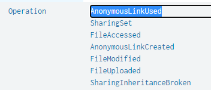



- secnario #1  
Note: All the information you need to answer each question is present within the question itself. You just need to figure out how to create the proper splunk search query that will get you the information you want.  
각 질문에 답하는 데 필요한 모든 정보는 질문 자체에 있습니다. 원하는 정보를 얻을 수 있는 적절한 splunk 검색 쿼리를 생성하는 방법을 알아내기만 하면 됩니다.

BOTS-V3

index=botsv3의 sourcetype은 아래와 같습니다.

```
| metadata type=sourcetypes index=botsv3
| stats values(sourcetype)
```
- sourcetype 목록  

|values(sourcetype)|
|---|
|PerfmonMk:Process|
|Script:GetEndpointInfo|
|Script:InstalledApps|
|Script:ListeningPorts|
|Unix:ListeningPorts|
|Unix:SSHDConfig|
|Unix:Service|
|Unix:Update|
|Unix:Uptime|
|Unix:UserAccounts|
|Unix:Version|
|WinHostMon|
|access_combined|
|alternatives|
|amazon-ssm-agent|
|amazon-ssm-agent-too_small|
|apache_error|
|aws:cloudtrail|
|aws:cloudwatch|
|aws:cloudwatch:guardduty|
|aws:cloudwatchlogs|
|aws:cloudwatchlogs:vpcflow|
|aws:config:rule|
|aws:description|
|aws:elb:accesslogs|
|aws:rds:audit|
|aws:rds:error|
|aws:s3:accesslogs|
|bandwidth|
|bash_history|
|bootstrap|
|cisco:asa|
|cloud-init|
|cloud-init-output|
|code42:api|
|code42:computer|
|code42:org|
|code42:security|
|code42:user|
|config_file|
|cpu|
|cron-too_small|
|df|
|dmesg|
|dpkg|
|error-too_small|
|errors|
|errors-too_small|
|ess_content_importer|
|hardware|
|history-2|
|interfaces|
|iostat|
|lastlog|
|linux_audit|
|linux_secure|
|localhost-5|
|lsof|
|maillog-too_small|
|ms:aad:audit|
|ms:aad:signin|
|ms:o365:management|
|ms:o365:reporting:messagetrace|
|netstat|
|o365:management:activity|
|openPorts|
|osquery:info|
|osquery:results|
|osquery:warning|
|out-3|
|package|
|protocol|
|ps|
|stream:arp|
|stream:dhcp|
|stream:dns|
|stream:http|
|stream:icmp|
|stream:igmp|
|stream:ip|
|stream:mysql|
|stream:smb|
|stream:smtp|
|stream:tcp|
|stream:udp|
|symantec:ep:agent:file|
|symantec:ep:agt_system:file|
|symantec:ep:behavior:file|
|symantec:ep:packet:file|
|symantec:ep:risk:file|
|symantec:ep:scm_system:file|
|symantec:ep:security:file|
|symantec:ep:traffic:file|
|syslog|
|time|
|top|
|usersWithLoginPrivs|
|vmstat|
|who|
|wineventlog|
|xmlwineventlog|
|yum-too_small|

300	What is the full user agent string that uploaded the malicious link file to OneDrive?  
OneDrive에 악성 링크 파일을 업로드한 전체 사용자 에이전트 문자열은 무엇입니까?
<details>
  <summary>hint#1</summary>
    Use ms:o365:management as the sourcetype for OneDrive activity.<br>
    OneDrive 활동의 원본 유형으로 ms:o365:management를 사용합니다.
</details>
<details>
  <summary>hint#2</summary>
    A link (or .lnk) file is a shortcut file. Look for link files that are associated with OneDrive.<br>
    링크(또는 .lnk) 파일은 바로 가기 파일입니다. OneDrive와 연결된 링크 파일을 찾습니다.
</details>
<details>
  <summary>hint#3</summary>
    Filter your search to just upload activity.<br>
    활동을 업로드하기 위해 검색을 필터링하십시오.
</details>

OneDrive를 검색하니 sourcetype이 ms:o365:management, o365:management:activity 두가지가 나옵니다.
두가지 sourcetype의 필드를 조사해보니 Operation의 필드에 FileUploaded라는 값이 있습니다.
이 sourcetype에 UserAgent 필드가 있으므로 해당 값이 답일것입니다.

```
OneDrive .lnk Operation=FileUploaded
| table UserAgent
```

답 : Mozilla/5.0 (X11; U; Linux i686; ko-KP; rv: 19.1br) Gecko/20130508 Fedora/1.9.1-2.5.rs3.0 NaenaraBrowser/3.5b4

301	What external client IP address is able to initiate successful logins to Frothly using an expired user account?  
만료된 사용자 계정을 사용하여 Frothly에 성공적으로 로그인할 수 있는 외부 클라이언트 IP 주소는 무엇입니까?
<details>
  <summary>hint#1</summary>
    Use ms:aad:signin as the sourcetype for Azure Active Directory sign-in activity.<br>
    Azure Active Directory 로그인 활동의 소스 유형으로 ms:aad:signin을 사용합니다.
</details>

로그인관련 이벤트는 AD에있을것입니다. sourcetype에 **ms:aad:signin**란 sourcetype이 있습니다.
expired 키워드로 조사해봅니다.

```
sourcetype=ms:aad:signin expired
```

ID는 Kevin Lagerfield, ip는 199.66.91.253, expired된 비밀번호로 로그인을 시도했습니다.
해당 정보로 다시 검색해봅니다.

```
sourcetype=ms:aad:signin "Kevin Lagerfield" 199.66.91.253
```

해당 계정으로 로그인을 성공한 이벤트를 발견할 수 있습니다.

답 : 199.66.91.253

302	According to Symantec's website, what is the discovery date of the malware identified in the macro-enabled file? Answer guidance: Provide the US date format MM/DD/YY. (Example: January 1, 2019 should be provided as 01/01/19)  
시만텍 웹사이트에 따르면 매크로 실행 파일에서 식별된 악성코드의 발견 날짜는 언제입니까? 답변 안내: 미국 날짜 형식 MM/DD/YY를 제공하십시오. (예시: 2019년 1월 1일은 01/01/19로 제공되어야 함)
<details>
  <summary>hint#1</summary>
    Use ms:aad:signin as the sourcetype for Azure Active Directory sign-in activity.
    Azure Active Directory 로그인 활동의 소스 유형으로 ms:aad:signin을 사용합니다.
</details>
<details>
  <summary>hint#2</summary>
    Use WinEventLog:Application as the sourcetype to identify the security risk found.<br>
    WinEventLog:Application을 소스 유형으로 사용하여 발견된 보안 위험을 식별합니다.        
</details>
<details>
  <summary>hint#3</summary>
    Google search for that risk and the term Symantec together.<br>
    Google에서 해당 위험과 Symantec이라는 용어를 함께 검색합니다.
</details>

조사 방향을 잡기힘드니 **macro**로 검색해봅니다.
```
*macro*
```

그럼 19개의 이벤트가 발생하는데, stream:smtp로그가 눈에 띕니다.

첨부파일 **Malware Alert Text.txt**의 base64 인코딩값을 발견할 수 있습니다. 디코딩해봅시다.

```
Malware was detected in one or more attachments included with this email message. 
Action: All attachments have been removed.
Frothly-Brewery-Financial-Planning-FY2019-Draft.xlsm	 W97M.Empstage
```

추후 마저 풀겠음 

303	What is the password for the user that was successfully created by the user "root" on the on-premises Linux system?  
온프레미스 Linux 시스템에서 사용자 "루트"가 성공적으로 생성한 사용자의 비밀번호는 무엇입니까?
<details>
  <summary>hint#1</summary>
    Use osquery:results as the sourcetype.<br>
    sourcetype osquery:results에서 조사하세요.
</details>
<details>
  <summary>hint#2</summary>
    Osquery is logging command executions on the Linux host hoth.<br>
    Osquery는 Linux 호스트 hoth에서 명령 실행을 기록하고 있습니다.
</details>

linux에서 사용자 추가명령어는 useradd 혹은 adduser입니다.

```
sourcetype=osquery:results *useradd* OR *adduser*
```
이벤트2개가 뜹니다.

cmdline: "useradd" "-ou" "tomcat7" "-p" "ilovedavidverve" "0" "-g" "0" "-M" "-N" "-r" "-s" "/bin/bash"
cmdline: "useradd" "-ou" "tomcat7" "-p" "davidverve.com" "0" "-g" "0" "-M" "-N" "-r" "-s" "/bin/bash"

이중, 실행한 uid가 0인 이벤트의 비밀번호값은 ilovedavidverve입니다.

답 : ilovedavidverve

304	What is the name of the user that was created after the endpoint was compromised?  
엔드포인트가 손상된 후 생성된 사용자의 이름은 무엇입니까?
<details>
  <summary>hint#1</summary>
    Use WinEventLog:Security as the sourcetype.<br>
    WinEventLog:Security를 ​​소스 유형으로 사용하십시오.    
</details>

엔드포인트라고 했으니, 윈도우 시스템일 것입니다. 이벤트로그에서 계정생성 이벤트를 찾아봅시다.
구글에 검색하니 계정생성 윈도우이벤트로그 ID는 4720입니다.


```
sourcetype=WinEventLog EventCode=4720
```
한개의 이벤트가 나옵니다. 
Account Name:		svcvnc

답 : svcvnc

305	What is the process ID of the process listening on a "leet" port?  
"leet" 포트에서 수신 대기하는 프로세스의 프로세스 ID는 무엇입니까?
<details>
  <summary>hint#1</summary>
    Use osquery:results as the sourcetype.<br>
    osquery:results를 소스 유형으로 사용하십시오.
</details>
<details>
  <summary>hint#2</summary>
    Osquery is logging open ports found on the Linux host hoth.<br>
    Osquery는 Linux 호스트 hoth에서 발견된 열린 포트를 기록하고 있습니다.
</details>

[leet](https://en.wikipedia.org/wiki/Leet)는 1337포트를 사용하는 서비스입니다. PID는 sourcetype ps에서 확인할 수 있을것입니다.

```
1337 sourcetype=ps
```
- 결과
```
root             14356     0      0.0      00:00:00     0.1       1732       6492   ?        S         31:58  netcat              -v_-l_-p_1337_-e_/bin/bash
```
pid는 14356임을 알 수 있습니다.

답 : 14356

306	A search query originating from an external IP address of Frothly's mail server yields some interesting search terms. What is the search string?
Frothly 메일 서버의 외부 IP 주소에서 시작되는 검색 쿼리는 몇 가지 흥미로운 검색어를 생성합니다. 검색 문자열은 무엇입니까?
<details>
  <summary>hint#1</summary>
    Use o365:management:activity as the sourcetype.
    sourcetype o365:management:activity에서 조사하십시오.
</details>

ms office를 사용하는것을 알고있으니, Outlook 혹은 Exchange를 사용할 것입니다. o365관련 sourcetype에서 키워드 query를 조사해봅니다.

```
sourcetype=*o365* (Exchange OR Outlook) *query*
```

아래와 같은 로그를 발견할 수 있습니다.

ClientIP: 104.207.83.63:21974
user: fyodor@froth.ly
Workload: Exchange
UserKey: 1003BFFDA2E71FF9
UserType: 2
Name: SearchQuery
Value: cromdale OR beer OR financial OR secret 

답 : cromdale OR beer OR financial OR secret 

307	What is the MD5 value of the file downloaded to Fyodor's endpoint system and used to scan Frothly's network?  
Fyodor의 엔드포인트 시스템에 다운로드되어 Frothly의 네트워크를 스캔하는 데 사용되는 파일의 MD5 값은 무엇입니까?
<details>
  <summary>hint#1</summary>
    
</details>
실행파일의 hash값은 sysmon로그에 있습니다.
sourcetype으로 제공되지않고, source로 제공합니다.
파일이 실행됐다면 process creation이벤트가 발생했을것입니다.(EventID=1)
어떤 파일이 실행됐는지 파악할 수 있도록 Image필드의 값을 봅시다.

```
host=FYODOR-L source="WinEventLog:Microsoft-Windows-Sysmon/Operational" EventID=1 
| stats count by Image
```
Images 중 "C:\\Windows\\Temp\\hdoor.exe"라는 특이한 실행파일이 보입니다.
CommandLine을 보면 "C:\windows\temp\hdoor.exe" -hbs 192.168.9.1-192.168.9.50 /b /m /n 식으로 네트워크 대역관련 인자가 보입니다.

답 : 586EF56F4D8963DD546163AC31C865D7

308	Based on the information gathered for question 304, what groups was this user assigned to after the endpoint was compromised? Answer guidance: Comma separated without spaces, in alphabetical order.  
문제 304에 대해 수집된 정보에 따르면 엔드포인트가 손상된 후 이 사용자는 어떤 그룹에 할당되었습니까? 답변 안내: 알파벳 순서로 공백 없이 쉼표로 구분됩니다.
<details>
  <summary>hint#1</summary>
    
</details>

계정명 svcvnc의 그룹을 알아봅시다.


[sysmon Group할당](https://www.ultimatewindowssecurity.com/securitylog/encyclopedia/event.aspx?eventID=4732)eventID는 4732입니다.

```
svcvnc EventCode=4732
```
이벤트 2개가 나옵니다.

답 : Administrators,Users

309	At some point during the attack, a user's domain account is disabled. What is the email address of the user whose account gets disabled and what is the email address of the user who disabled their account? Answer guidance: Comma separated without spaces, in alphabetical order. (Example: jdoe@mycompany.com,tmiller@mycompany.com)  
공격 중간에 어느 시점에서 사용자의 도메인 계정이 비활성화됩니다. 계정이 비활성화된 사용자의 이메일 주소는 무엇이며 계정을 비활성화한 사용자의 이메일 주소는 무엇입니까? 답변 안내: 알파벳 순서로 공백 없이 쉼표로 구분됩니다. (예: jdoe@mycompany.com,tmiller@mycompany.com)
<details>
  <summary>hint#1</summary>
    
</details>

[sysmon account disable](https://www.ultimatewindowssecurity.com/securitylog/encyclopedia/event.aspx?eventID=4725)eventID는 4725입니다.

```
EventCode=4725
```

아무이벤트도 나오지 않습니다.

AD에서 찾아봅시다.

```
sourcetype=ms:aad:* *user* OR *account* OR *disable*
```

activity라는 필드에 **Disable account**가 보입니다.

```
sourcetype=ms:aad:* activity="Disable account"
```


actor부분에 **fyodor@froth.ly**라는 이메일계정을 발견할 수 있습니다.

target을 보면 **bgist@froth.ly**라는 이메일계정또한 발견할 수 있습니다.

답 : bgist@froth.ly,fyodor@froth.ly

310	Another set of phishing emails were sent to Frothly employees after the adversary gained a foothold on a Frothly computer. This malicious content was detected and left behind a digital artifact. What is the name of this file? Answer guidance: Include the file extension. (Example: badfile.docx)  
공격자가 Frothly 컴퓨터에 발판을 마련한 후 또 다른 피싱 이메일 세트가 Frothly 직원에게 전송되었습니다. 이 악성 콘텐츠는 감지되어 디지털 아티팩트를 남겼습니다. 이 파일의 이름은 무엇입니까? 답변 지침: 파일 확장자를 포함합니다. (예: badfile.docx)
<details>
  <summary>hint#1</summary>
    
</details>

문제 302번에서 발견한 **Frothly-Brewery-Financial-Planning-FY2019-Draft.xlsm**파일이 생각납니다. 

해당 파일명으로 검색해보면 auto-sacning되어 지워졌음을 확인할 수 있습니다.

답 : Frothly-Brewery-Financial-Planning-FY2019-Draft.xlsm

311	Based on the answer to question 310, what is the name of the executable that was embedded in the malware? Answer guidance: Include the file extension. (Example: explorer.exe)  
310번 문제에 대한 답변에 따르면 악성코드에 포함된 실행 파일의 이름은 무엇입니까? 답변 지침: 파일 확장자를 포함합니다. (예: explorer.exe)
<details>
  <summary>hint#1</summary>
    
</details>

바로 다음이벤트의 Image에 exe파일이 있습니다.


답 : HxTsr.exe

312	How many unique IP addresses "used" the malicious link file that was sent?  
전송된 악성 링크 파일을 "사용"한 고유 IP 주소는 몇 개입니까?
<details>
  <summary>hint#1</summary>
    
</details>

300번문제에서 파악한 악성 링크파일의 이름은 **BRUCE BIRTHDAY HAPPY HOUR PICS.lnk**입니다.

```
"BRUCE BIRTHDAY HAPPY HOUR PICS.lnk"
```

67개의 이벤트가 있습니다.
그중 operation field값 중 **AnonymousLinkUsed**이 눈에 띕니다.



```
"BRUCE BIRTHDAY HAPPY HOUR PICS.lnk"  Operation=AnonymousLinkUsed
| stats dc(ClientIP)
```

답 : 7

313문제도 없네요

314	What port number did the adversary use to download their attack tools?  
공격자가 공격 도구를 다운로드하는 데 사용한 포트 번호는 무엇입니까?
<details>
  <summary>hint#1</summary>
    
</details>

stream:tcp에서 조사해봅니다.
well-known포트가 아닌 포트 중 한번만 다운로드 한 이벤트를 찾아봅시다.

```
sourcetype=stream:tcp
| stats count by dest_port
```
45.77.53.176:3333과 192.168.8.103:50504가 count 1입니다.
외부망 IP인 45.77.53.176이 의심스럽습니다.
stream:http에서 확인해봅시다.

**uri_path: /images/logos.png**를 발견할 수 있습니다.

답 : 3333

315	During the attack, two files are remotely streamed to the /tmp directory of the on-premises Linux server by the adversary. What are the names of these files? Answer guidance: Comma separated without spaces, in alphabetical order, include the file extension where applicable.  
공격하는 동안 공격자는 온프레미스 Linux 서버의 /tmp 디렉터리에 두 개의 파일을 원격으로 스트리밍합니다. 이 파일의 이름은 무엇입니까? 답변 안내: 알파벳 순서로 공백 없이 쉼표로 구분하고 해당되는 경우 파일 확장자를 포함합니다.
<details>
  <summary>hint#1</summary>
    
</details>

file upload 관련 로그는 osquery에 있을것입니다. create, upload관련 행위를 하는 데이터를 찾아봅시다.
```
sourcetype=osquery:results */tmp*.* "columns.action"=CREATED
```
create한 user 중 **tomcat8**을 발견할 수 있습니다. tomcat7이 악성행위하는 계정을 생성했으니 해당 계정도 의심스럽습니다.

```
sourcetype=osquery:results */tmp*.* "columns.action"=CREATED "decorations.username"=tomcat8
| table columns.target_path
```


|columns.target_path|
|---|
|/tmp/ccgZ61x9.o|
|/tmp/cclBJ1WV.s|
|/tmp/colonel.c|
|/tmp/definitelydontinvestigatethisfile.sh|

실행파일은 colonel.c와 definitelydontinvestigatethisfile.sh입니다.

316	Based on the information gathered for question 314, what file can be inferred to contain the attack tools? Answer guidance: Include the file extension.  
314번 문제에 대해 수집된 정보를 바탕으로 공격 도구가 포함된 것으로 유추할 수 있는 파일은 무엇입니까? 답변 지침: 파일 확장자를 포함합니다.
<details>
  <summary>hint#1</summary>
    
</details>

답 : logos.png

317	What is the first executable uploaded to the domain admin account's compromised endpoint system? Answer guidance: Include the file extension.  
도메인 관리자 계정의 손상된 엔드포인트 시스템에 업로드된 첫 번째 실행 파일은 무엇입니까? 답변 지침: 파일 확장자를 포함합니다.
<details>
  <summary>hint#1</summary>
    
</details>

domain admin의 GUI는 (**S-1-5-21*-512**)[https://docs.microsoft.com/en-US/windows/security/identity-protection/access-control/security-identifiers]과 같습니다.
이 키워드로 검색해도 아무것도 나오지않습니다.

sysmon에서 .exe확장자 파일을 검색해봅니다. 악성코드는 보통 tmp, temp파일에 업로드하니 경로조건도 추가해봅니다.

```
*.exe source="WinEventLog:Microsoft-Windows-Sysmon/Operational" Image IN(*tmp*, *temp*)
| stats count by Image
```


|Image|count|
|---|---|
|C:\Users\ALBUNG~1\AppData\Local\Temp\632F4847-CD24-4609-823F-C2C020FD03EB\DismHost.exe	|2|
|C:\Users\BRUCEG~1\AppData\Local\Temp\GUM4F89.tmp\DropboxUpdate.exe	|9|
|C:\Users\BruceGist\AppData\Local\Packages\Microsoft.MicrosoftEdge_8wekyb3d8bbwe\TempState\Downloads\DropboxInstaller.exe	|6|
|C:\Users\FYODOR~1\AppData\Local\Temp\3F5D15FE-AD68-4E1F-B3C4-90E199AF3640\DismHost.exe	|2|
|C:\Users\PeatCerf\AppData\Local\Temp\9027560D-FED5-45FC-A0CC-89A7591BC00E\DismHost.exe	|2|
|C:\Windows\Temp\hdoor.exe	|20|
|C:\Windows\Temp\unziped\lsof-master\iexeplorer.exe	|51|

**hdoor.exe**이 굉장히 의심스럽습니다.

```
*.exe source="WinEventLog:Microsoft-Windows-Sysmon/Operational" Image IN(*tmp*, *temp*)
| dedup Image
| table _time Image Computer User SourceIp DestinationIp
| reverse
```

|_time|Image|Computer|User|SourceIp|DestinationIp|
|---|---|---|---|---|---|
|2018/08/20 09:16:50|C:\Users\ALBUNG~1\AppData\Local\Temp\632F4847-CD24-4609-823F-C2C020FD03EB\DismHost.exe|	ABUNGST-L.froth.ly|
|2018/08/20 10:33:27|C:\Users\BRUCEG~1\AppData\Local\Temp\GUM4F89.tmp\DropboxUpdate.exe|                      BGIST-L.froth.ly|
|2018/08/20 10:33:27|C:\Users\BruceGist\AppData\Local\Packages\Microsoft.MicrosoftEdge_8wekyb3d8bbwe\TempState\Downloads\DropboxInstaller.exe|BGIST-L.froth.ly|
|2018/08/20 10:44:05|C:\Windows\Temp\hdoor.exe|FYODOR-L.froth.ly|AzureAD\FyodorMalteskesko|192.168.8.103|192.168.9.50|
|2018/08/20 11:34:02|C:\Windows\Temp\unziped\lsof-master\iexeplorer.exe|FYODOR-L.froth.ly	|AzureAD\FyodorMalteskesko|192.168.8.103|192.168.9.30|
|2018/08/20 11:34:33|C:\Users\FYODOR~1\AppData\Local\Temp\3F5D15FE-AD68-4E1F-B3C4-90E199AF3640\DismHost.exe	|FYODOR-L.froth.ly|
|2018/08/20 15:00:41|C:\Users\PeatCerf\AppData\Local\Temp\9027560D-FED5-45FC-A0CC-89A7591BC00E\DismHost.exe	|PCERF-L.froth.ly|

가장 먼저 업로드된 파일은 hdoor.exe입니다.

답 : hdoor.exe

318	From what country is a small brute force or password spray attack occurring against the Frothly web servers?  
Frothly 웹 서버에 대해 소규모 무차별 대입 공격 또는 암호 스프레이 공격이 어느 국가에서 발생합니까?
<details>
  <summary>hint#1</summary>
    Use linux_secure as the sourcetype.
    sourcetype linux_secure에서 조사하세요.
</details>

힌트에서 sourcetype linux_secure에 답이있다고 알려줍니다.
[linux_secure](https://splunkbase.splunk.com/app/3476/)

vendor_action필드에 **Invalid user**란 값이있으니 조건을 추가해봅니다.
```
sourcetype=linux_secure vendor_action="Invalid user"
```

해당 로그에서 발견한 IP는 **5.101.40.81**입니다.

whois에 검색해봅시다.


해당 IP국가는 러시아입니다.

답 : RUSSIA

319	The adversary created a BCC rule to forward Frothly's email to his personal account. What is the value of the "Name" parameter set to?  
공격자는 Frothly의 이메일을 자신의 개인 계정으로 전달하는 BCC 규칙을 만들었습니다. "Name" 매개변수의 값은 무엇으로 설정되어 있습니까?
<details>
  <summary>hint#1</summary>
    Use ms:o365:management as the sourcetype.
    sourcetype ms:o365:management에서 조사하세요.
</details>

[BCC룰이란?](https://bluemail.help/ko/myself-bcc-automatically/)
BCC는 숨은참조입니다. 숨은참조 룰을 찾아봅시다.

```
sourcetype=ms:o365:management *Frothly* *Name* (*bcc* OR *Rule* OR *Blind*Carbon*Copy*)
```


공격자의 메일주소 hyunki1984@naver.com로 BlindCopyTo를 보내는 **New-TransportRule**룰을 생기는 이벤트입니다.

답 : SOX

320	What is the password for the user that was created on the compromised endpoint?  
손상된 엔드포인트에서 생성된 사용자의 비밀번호는 무엇입니까?
<details>
  <summary>hint#1</summary>
    Use WinEventLog:Security as the sourcetype.
    sourcetype WinEventLog:Security에서 조사하세요.
</details>

svcvnc를 키워드로 검색하면 아래와 같은 이벤트를 발견할 수 있습니다.

Process Command Line:	C:\Windows\system32\net1 user /add svcvnc Password123!

답 : Password123!

321	The Taedonggang adversary sent Grace Hoppy an email bragging about the successful exfiltration of customer data. How many Frothly customer emails were exposed or revealed?  
대동강은 Grace Hoppy에게 성공적인 고객 데이터 유출에 대해 자랑하는 이메일을 보냈습니다. 얼마나 많은 Frothly 고객 이메일이 노출되거나 공개되었습니까?
<details>
  <summary>hint#1</summary>
    Use stream:smtp as the sourcetype.
    sourcetype stream:smtp에서 조사하세요.
</details>

Grace Hoppy의 이메일주소는 **ghoppy@froth.ly**입니다.
smtp에서 수신자 ghoppy@froth.ly인 이벤트를 찾아봅시다.

```
sourcetype=stream:smtp receiver_email{}=ghoppy@froth.ly
```
sender_email이 **hyunki1984@naver.com**인 이벤트가 1개있습니다.
base64인코딩된 데이터를 디코딩해봅시다.

```
R3JhY2llLAoKICAgICAgIFdlIGJyb3VnaHQgeW91ciBkYXRhIGFuZCBpbXBvcnRlZCBpdDogaHR0
cHM6Ly9wYXN0ZWJpbi5jb20vc2RCVWt3c0UgQWxzbywgeW91IHNob3VsZCBub3QgYmUgdG9vIGhh
cmQgQnJ1Y2UuIEhlIGdvb2QgbWFuIAogCiAKIAogCg==
(Decoding)→
Gracie,
We brought your data and imported it: https://pastebin.com/sdBUkwsE Also, you should not be too hard Bruce. He good man 
```

해당 url로 가보면 총 8명입니다.


답 : 8

322	What is the path of the URL being accessed by the command and control server? Answer guidance: Provide the full path. (Example: The full path for the URL https://imgur.com/a/mAqgt4S/lasd3.jpg is /a/mAqgt4S/lasd3.jpg)
명령 및 제어 서버가 액세스하는 URL의 경로는 무엇입니까? 답변 안내: 전체 경로를 제공하세요. (예: https://imgur.com/a/mAqgt4S/lasd3.jpg URL의 전체 경로는 /a/mAqgt4S/lasd3.jpg입니다.)
<details>
  <summary>hint#1</summary>
    Start with XmlWinEventLog:Microsoft-Windows-Sysmon/Operational as the sourcetype, or review the PowerShell logging on various Frothly laptops.
    XmlWinEventLog:Microsoft-Windows-Sysmon/Operational을 소스 유형으로 시작하거나 다양한 Frothly 랩톱에서 PowerShell 로깅을 검토합니다.
</details>

323	At least two Frothly endpoints contact the adversary's command and control infrastructure. What are their short hostnames? Answer guidance: Comma separated without spaces, in alphabetical order.  
최소 2개의 Frothly 엔드포인트가 적의 명령 및 제어 인프라에 접속합니다. 짧은 호스트 이름은 무엇입니까? 답변 안내: 알파벳 순서로 공백 없이 쉼표로 구분됩니다.
<details>
  <summary>hint#1</summary>
    
</details>

324	Who is Al Bungstein's cell phone provider/carrier? Answer guidance: Two words.  
324 Al Bungstein의 휴대전화 제공업체/이동통신사는 누구인가요? 답변 안내: 두 단어.
<details>
  <summary>hint#1</summary>
    How can you find out what external IP address Al Bungstein is using?<br>
    Al Bungstein이 사용하는 외부 IP 주소를 어떻게 알 수 있습니까?
</details>
<details>
  <summary>hint#2</summary>
    OSINT is your friend here. Pivot off of Al's external IP.<br>
    OSINT는 여기 당신의 친구입니다. Al의 외부 IP를 피벗합니다.
</details>
<details>
  <summary>hint#3</summary>
    There is a single sourcetype in Splunk that also contains this information. It is a scripted input running on Al's machine.<br>
    Splunk에는 이 정보도 포함하는 단일 소스 유형이 있습니다. Al의 시스템에서 실행되는 스크립트 입력입니다.
</details>

Al Bungstein의 이메일은 **abungstein@froth.ly**입니다.
ip : 174.215.1.81

해당 ip를 [whois](https://domain.whois.co.kr/whois/search.php)에 조회해보면


답 : Verizon Wireless

325	Microsoft cloud services often have a delay or lag between "index time" and "event creation time". For the entire day, what is the max lag, in minutes, for the sourcetype: ms:aad:signin? Answer guidance: Round to the nearest minute without the unit of measure.  
Microsoft 클라우드 서비스는 종종 "인덱스 시간"과 "이벤트 생성 시간" 사이에 지연 또는 지연이 있습니다. 전체일 중 ms:aad:signin의 최대 지연 시간(분)은 얼마입니까? 답변 안내: 측정 단위 없이 가장 가까운 분으로 반올림합니다.
<details>
  <summary>hint#1</summary>

</details>
```
sourcetype=ms:aad:signin  
| eval indextime=strftime(_indextime,"%Y-%m-%d %H:%M:%S") 
| eval time=strftime(_time,"%Y-%m-%d %H:%M:%S") 
| eval indextime_epoch=strptime(indextime,"%Y-%m-%d %H:%M:%S")
| eval time_epoch=strptime(time, "%Y-%m-%d %H:%M:%S")
| table time, indextime, indextime_epoch, time_epoch
| eval delta=indextime_epoch-time_epoch
| stats max(delta) as max_lag
| eval minutes=max_lag / 60
```
326	According to Mallory's advertising research, how is beer meant to be enjoyed? Answer guidance: One word.  
Mallory의 광고 연구에 따르면 맥주는 어떻게 즐길 수 있습니까? 답변 안내: 한 마디.
<details>
  <summary>hint#1</summary>
    
</details>

327도 문제 없습니다.

328	What text is displayed on line 2 of the file used to escalate tomcat8's permissions to root? Answer guidance: Provide contents of the entire line.  
tomcat8의 권한을 루트로 에스컬레이션하는 데 사용되는 파일의 2행에 어떤 텍스트가 표시됩니까? 답변 안내: 전체 라인의 내용을 제공합니다.
<details>
  <summary>hint#1</summary>
    Start with any sourcetype that provides detailed process execution data, or one that provides clear-text details of information posted to the Linux host hoth.<br>
    자세한 프로세스 실행 데이터를 제공하는 소스 유형이나 Linux 호스트 hoth에 게시된 정보의 일반 텍스트 세부 정보를 제공하는 소스 유형으로 시작하십시오.
</details>
<details>
  <summary>hint#2</summary>
    You are looking for a long string of base64 information.
    긴 base64 정보 문자열을 찾고 있습니다.
</details>

osquery에 실행관련 이벤트가 있을것입니다. 어떤 계정이 어떤 명령을 실행했는지 조사해봅니다.

```
sourcetype=osquery:results tomcat8 columns.cmdline=*
| table _time decorations.username columns.cmdline
| reverse
```

중간에 **"chmod" "+x" "colonelnew"**, **"./colonelnew"**의 이벤트를 발견할 수 있습니다. 
**colonelnew**은 315번문제에서 발견한 파일과 비슷합니다. sourcetype sysmon에서 cat colonel.c의 로그가 있었습니다.

```
*colonel* source="WinEventLog:Microsoft-Windows-Sysmon/Operational"
```
중간 **C:\windows\temp\unziped\lsof-master\iexeplorer.exe" http://192.168.9.30:8080/frothlyinventory/showcase.action "echo Ly.... &gt;&gt; /tmp/colonel**과 같은 명령어가 보입니다.
해당 base64를 /tmp/colonel파일로 옮기는것처럼 보입니다. 해당 데이터를 base64로 디코딩해봅니다.

시작 : LyoKICogVWJ1bnR1IDE2
끝 : JldHVybiAwOwp9 &gt;&gt


답 :  * Ubuntu 16.04.4 kernel priv esc

329	One of the files uploaded by Taedonggang contains a word that is a much larger in font size than any other in the file. What is that word?
대동강이 업로드한 파일 중 하나에는 파일의 다른 어떤 것보다 훨씬 큰 글자 크기의 단어가 포함되어 있습니다. 그 단어는 무엇입니까?
<details>
  <summary>hint#1</summary>
    Figure out what files were uploaded, and pivot off of interesting file names found. The WinEventLog:Security sourcetype is helpful, as is the osquery:results sourcetype.<br>
    어떤 파일이 업로드되었는지 파악하고 발견된 흥미로운 파일 이름을 중심으로 중심을 잡습니다. WinEventLog:Security 소스 유형은 osquery:results 소스 유형과 마찬가지로 유용합니다.
</details>
<details>
  <summary>hint#2</summary>
    You are looking for a long string of base64 information.<br>
    긴 base64 정보 문자열을 찾고 있습니다.
</details>
<details>
  <summary>hint#3</summary>
    You will need to find a site to decode the base64 to a viewable image. CyberChef is a good one!
    base64를 볼 수 있는 이미지로 디코딩하려면 사이트를 찾아야 합니다. CyberChef는 좋은 사람입니다!
</details>

지금까지 문제에서 대동강그룹이 업로드한 파일은 colonel, Frothly_GABF_Deck-2018-MK.pptx, 1534778082419.png, definitelydontinvestigatethisfile.sh로 파악했습니다.
각 검색하여 base64 디코딩해봅시다.
**definitelydontinvestigatethisfile.sh**를 검색해보면
sysmon에 아래 base64 코드들이 있습니다.
시작 : /9j/4AAQSkZJRgABAQAAAQABAAD/
끝 : BvdGF0byBwaG9uZQo=

해당 데이터를 디코드해보면 아래와 같습니다. 


답 : splunk

330	What Frothly VPN user generated the most traffic? Answer guidance: Provide the VPN user name.  
어떤 Frothly VPN 사용자가 가장 많은 트래픽을 생성했습니까? 답변 안내: VPN 사용자 이름을 제공합니다.
<details>
  <summary>hint#1</summary>
    Start with cisco:asa as the sourcetype.
    sourcetype cisco:asa에서 조사하십시오.
</details>

```
sourcetype=cisco:asa eventtype=cisco_vpn
| stats count by Cisco_ASA_user
| sort -count
```

|Cisco_ASA_user|count|
|---|---|
|mkraeusen|38|
|bstoll|36|
|bgist|19|
|fyodor|14|
|pcerf|13|
|ghoppy|5|
|btun|3|
|abungstein|2|

답 : mkraeusen

331	Using Splunk commands only, what is the upper fence (UF) value of the interquartile range (IQR) of the count of event code 4688 by Windows hosts over the entire day? Use a 1.5 multiplier. Answer guidance: UF = Q3 + 1.5 x IQR  
Splunk 명령만 사용하는 경우 하루 종일 Windows 호스트의 이벤트 코드 4688 수에 대한 사분위수 범위(IQR)의 상한(UF) 값은 얼마입니까? 1.5 배율을 사용하십시오. 답변 안내: UF = Q3 + 1.5 x IQR
<details>
  <summary>hint#1</summary>
    Start with WinEventLog:Security as the sourcetype.<br>
    sourcetype WinEventLog:Security를 조사하십시오.
</details>
<details>
  <summary>hint#2</summary>
    Splunk commands such as eventstats, perc25() and perc75() would be helpful here.<br>
    여기에서 eventstats, perc25() 및 perc75()와 같은 Splunk 명령이 도움이 될 것입니다.
</details>
<details>
  <summary>hint#3</summary>
    If you have never used the interquartile range (IQR) to identify outliers, take a look at the documentation https://docs.splunk.com/Documentation/Splunk/latest/Search/Findingandremovingoutliers#Use_the_interquartile_range_.28IQR.29_to_identify_outliers<br>
    사분위수 범위(IQR)를 사용하여 이상값을 식별한 적이 없는 경우 https://docs.splunk.com/Documentation/Splunk/latest/Search/Findingandremovingoutliers#Use_the_interquartile_range_.28IQR.29_to_identify_outliers 문서를 참조하십시오.
</details>

[eventcode4688](https://www.ultimatewindowssecurity.com/securitylog/encyclopedia/event.aspx?eventID=4688)
새 process creation 이벤트 코드입니다.

```
sourcetype=wineventlog EventCode=4688
| eventstats perc25(count) as p25, perc75(count) as p75
| eval IQR=p75-p25
| eval UF=p75+1.5*IQR
```

답 : 1368

332	What is the CVE of the vulnerability that escalated permissions on Linux host hoth? Answer guidance: Submit in normal CVE format. (Example: cve-2018-9805)
Linux 호스트 hoth에서 권한을 에스컬레이션한 취약점의 CVE는 무엇입니까? 답변 안내: 일반 CVE 형식으로 제출하십시오. (예: cve-2018-9805)
<details>
  <summary>hint#1</summary>
    Start with any sourcetype that provides detailed process execution data, or one that provides clear-text details of information posted to the Linux host hoth.<br>
    자세한 프로세스 실행 데이터를 제공하는 소스 유형이나 Linux 호스트 hoth에 게시된 정보의 일반 텍스트 세부 정보를 제공하는 소스 유형으로 시작하십시오.
</details>
<details>
  <summary>hint#2</summary>
    You are looking for a long string of base64 information.
    긴 base64 정보 문자열을 찾고 있습니다.
</details>
<details>
  <summary>hint#3</summary>
    Google search.
    구글링 하세요.
</details>

328번문제에서 발견한 "* Ubuntu 16.04.4 kernel priv esc"를 구글링해봅시다.

[CVE-2017-16995](https://www.exploit-db.com/exploits/44298)

답 : CVE-2017-16995

333	What is the CVE of the vulnerability that was exploited to run commands on Linux host hoth? Answer guidance: Submit in normal CVE format. (Example: cve-2018-9805)  
Linux 호스트 hoth에서 명령을 실행하기 위해 악용된 취약점의 CVE는 무엇입니까? 답변 안내: 일반 CVE 형식으로 제출하십시오. (예: cve-2018-9805)
<details>
  <summary>hint#1</summary>
    
</details>